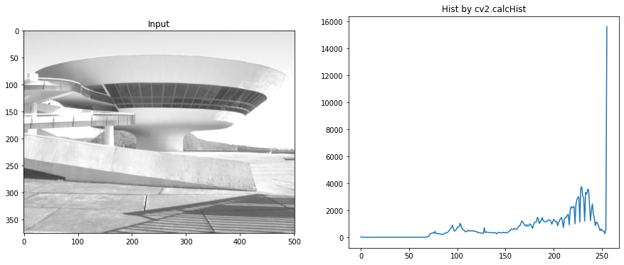
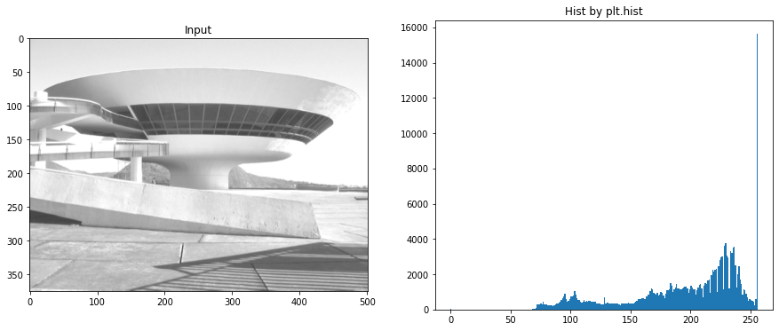

# Realce de imagens digitais
## Histograma
### Denfinição
- A Imagem possui uma série de informações armazenadas e uma das mais relevantes refere-se ao brilho (ou níveis de cinza) dos pixels;
- Uma das ferramentas mais simples e úteis para o PDI;
- Função que mostra a frequência com que um nível de cinza aparece na imagem;
- Pode ser visto como uma função de distribuição de frequência ou como uma função de distribuição de probabilidade.

### Representação
- O histograma de uma imagem pode ser representado por um gráfico de barras que mostra a quantidade de pixels que apresentam um determinado nível de cinza.
- Através da visualização do histograma de uma imagem obtém-se uma "ideia" da qualidade da imagem com relação ao seu nível de contraste e ao seu brilho médio (se a imagem é clara ou escura).

### calcHist no opencv
``` 
calcHist(images, channels, mask, histSize, ranges[, hist[, accumulate]]) → hist
```
- images: é a imagem de origem do tipo uint8 ou float32.
- máscara: imagem da máscara.
- intervalos: esta é a nossa gama. Normalmente, é [0,256].
- etc.

Exemplo: 

```
import cv2
import matplotlib.pyplot as plt
!gdown --id 1Q7chDJlP5_cI2SOERDfs1viyCW3IpqKA
img1 = cv2.imread("aula03fig01.png",0)
hf = cv2.calcHist([img1],[0],None,[256],[0,256])
plt.figure(figsize=(15,6)) 
plt.subplot(121),plt.imshow(img1,"gray"),plt.title('Input')
plt.subplot(122),plt.plot(hf),plt.title('Hist by cv2.calcHist')
plt.show()
```


### Hist no matplotlib
```
import matplotlib.pyplot as plt

plt.figure(figsize=(15,6)) 
plt.subplot(121),plt.imshow(img,"gray"),plt.title('Input')
plt.subplot(122),plt.hist(img.ravel(),256,[0,256]),plt.title('Hist by plt.hist')
plt.show()
```
