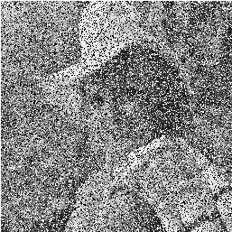
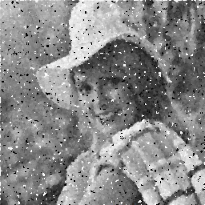

# Realce de imagens digitais
## Histograma
### Denfinição
- A Imagem possui uma série de informações armazenadas e uma das mais relevantes refere-se ao brilho (ou níveis de cinza) dos pixels;
- Uma das ferramentas mais simples e úteis para o PDI;
- Função que mostra a frequência com que um nível de cinza aparece na imagem;
- Pode ser visto como uma função de distribuição de frequência ou como uma função de distribuição de probabilidade.

### Representação
- O histograma de uma imagem pode ser representado por um gráfico de barras que mostra a quantidade de pixels que apresentam um determinado nível de cinza.
- Através da visualização do histograma de uma imagem obtém-se uma "ideia" da qualidade da imagem com relação ao seu nível de contraste e ao seu brilho médio (se a imagem é clara ou escura).

### Filtro Mediado

- Substitui o nível de cinza de cada pixel pelo nível de cinza mediano em uma vizinhança do pixel.
- O nível mediano de um conjunto de valores é tal que exista metade dos valores menores e metade dos valores maiores.
- Ruído é impulsivo (do tipo não contínuo, consistindo em pulsos irregulares de grandes amplitudes),
- Ruído do tipo sal e pimenta (representando descontinuidades abruptas e isoladas na imagem).

### Aplicação de Filtro Mediado

#### Imagem original:


#### Imagem com ruído:


#### Imagem com aplicação de Filtro Mediado 3x3:
```
np.vstack([np.hstack([cv2.medianBlur(img, 3)])])
```


#### Imagem com aplicação de Filtro Mediado 5x5 após aplicação de Filtro 3x3:
```
np.vstack([np.hstack([cv2.medianBlur(img, 5)])])
```
